```{r xaringan-themer, include=FALSE, warning=FALSE}
options(htmltools.dir.version = FALSE)
list.of.packages <- c("xaringan", "xaringanthemer")
new.packages <- list.of.packages[!(list.of.packages %in% installed.packages()[,"Package"])]
if(length(new.packages)) install.packages(new.packages)

library(xaringanthemer)
style_mono_accent(
  base_color          = "#1c5253",
  header_h1_font_size = "2.25rem",
  header_h2_font_size = "1.85rem",
  header_font_google  = google_font("Josefin Sans"),
  text_font_google    = google_font("Montserrat", "300", "300i"),
  text_font_size      = "1.25rem",
  code_font_google    = google_font("Fira Mono")
)
```

# Temas

* Por que precisamos de políticas públicas baseadas em evidências?

* Correlação, causas e efeitos

* Experimentos: a melhor ferramenta de análise estatística

* Separando correlação de causalidade em dados não-experimentais
  - Variáveis de controle
  - Regressão descontínua
  - Controle sintético

* Perguntas dos participantes

---

class: center, middle, inverse

# Políticas públicas baseadas em evidências

---

# Breve contexto

* Nos últimos 20 anos, as ciências sociais têm se dedicado cada vez mais à análise de relações de causa e efeito

* Historicamente, problemas de causalidade reversa e de falsas correlações dificultam o trabalho dos pesquisadores
  - Crescimento econômico e violência: qual dos dois vem primeiro?
  - Diferenças climáticas entre os países explicam níveis de desenvolvimento social?

* Tais problemas motivaram o uso de _novos modelos_ de análise de dados

* Grande mudança no paradigma de pesquisa:
  - Maior precisão a respeito dos efeitos causais
  - Uso de técnicas experimentais e quase-experimentais 

---

# O que são políticas públicas baseadas em evidências?

* A busca por maior rigor nas ciências sociais também chegou à administração pública

* Políticas baseadas em evidência são aquelas que _buscam resultados objetivos, utilizando as melhores técnicas disponíveis, para resolver um problema de ordem pública_

* Se contrapõem a análises fundamentadas no senso comum, na intuição e nas ideologias

* A meta é trazer maior eficiência e neutralidade na tomada de decisões dos agentes públicos

* Têm ganhado espaço significativo em diversos países, tais como os EUA e a Grã-Bretanha

---

# Exemplos

.center[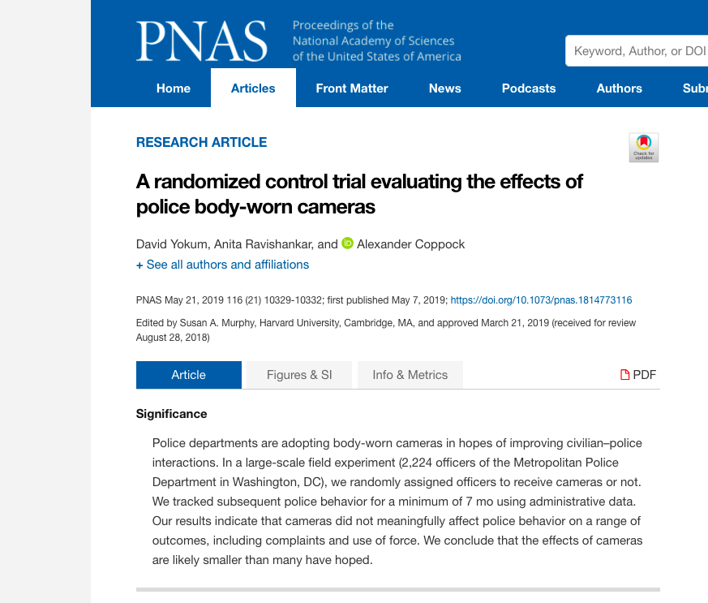]

---

# Exemplos

.center[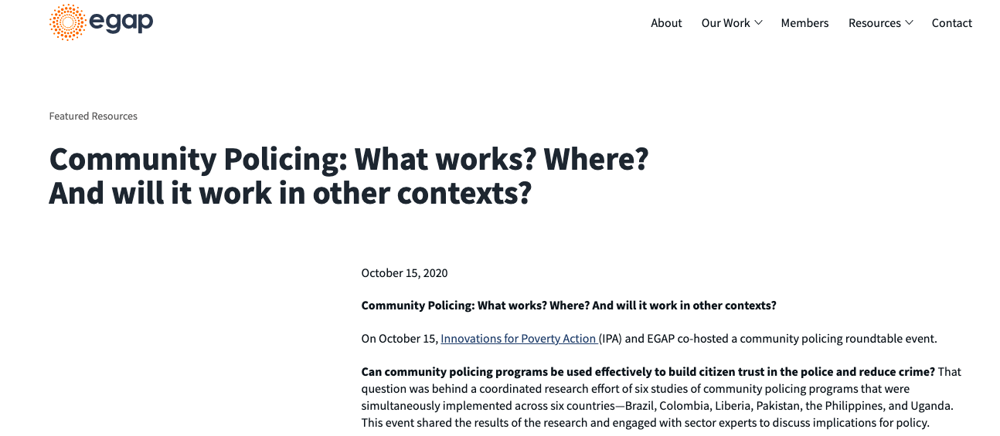]

---

# Exemplos

.center[]

---

class: center, middle, inverse

# Correlações, causas e efeitos: como saber o que realmente importa?

---

# Correlação não é causalidade

* Não é porque duas variáveis estão associadas que uma causa a outra

.center[]

---

# O que é uma relação de causa e efeito?

* Uma relação causal tem as seguintes características:

  - *Associação permanente*: "Se _X_ aumenta ou diminui, _Y_ tende a aumentar ou diminuir"

  - *Diferença contrafactual*: "Se _X_ não existisse, _Y_ seria maior ou menor"

  - *Manipulação*: "Sempre que alguém aumentar ou diminuir _X_, _Y_ vai ter um valor maior ou menor" (temporalidade)

  - **Não existe causalidade sem variação**

* "_X_ causa _Y_" não implica que _A_ ou _B_ não causem _Y_ também; _X_ é parte da história, mas não necessariamente toda a história

* "_X_ causa _Y_" pode ser "Com _X_, a probabilidade de _Y_ é maior ou menor do que sem _X_." ou "Sem _X_ não há _Y_". As duas interpretações são possíveis

---

# Resultados potenciais

* Para cada unidade no experimento -- uma pessoa, um bairro, um grupo -- existem dois resultados possíveis após o tratamento: $Y_{i}(1)$ e $Y_{i}(0)$

* $Y_{i}(1)$ é o resultado que seria observado se a unidade recebesse o tratamento ( $T_{i} = 1$ )

* $Y_{i}(0)$ é o resultado que seria observado se a unidade não recebesse o tratamento ( $T_{i} = 0$ )

* O efeito causal do tratamento, portanto, é $\tau_{i} = Y_{i}(1) - Y_{i}(0)$

* **Problema fundamental da inferência causal**: um indivíduo não pode receber e não receber o tratamento _ao mesmo tempo_, assim é impossível estimar o efeito causal para cada pessoa

* Assim, utilizamos o _efeito médio do tratamento_ como substituto: 
  - $\overline{\tau_{i}} = \frac{1}{N} \sum_{i = 1}^{N}(Y_{i}(1) - Y_{i}(0)) = \overline{Y_{i}(1)} - \overline{Y_{i}(0)}$

---

# Variáveis omitidas e viés de seleção

* O efeito causal médio nos permite saber o quanto as unidades são impactadas pelo tratamento

* Contudo, as unidades precisam ser _comparáveis_ para que o efeito seja uma medida útil e correta

* Comparar grupos que são sistematicamente diferentes produz uma estimativa enviesada do efeito causal
  - Efeito do Bolsa Família sobre educação infantil nos Jardins e no Capão Redondo
  - Efeito de policiamento comunitário no Rio de Janeiro e no Amazonas

* Damos o nome de _variáveis omitidas_ aqueles fatores que fazem os casos não serem comparáveis

* A distorção na escolha de unidades para comparação se chama _viés de seleção_

---

# Variáveis omitidas e viés de seleção

* Assim, para que as políticas públicas sejam efetivas, elas devem ser desenhadas de modo a evitar viés de seleção

* Com viés de seleção, os resultados (sejam positivos ou negativos) podem ser causados por _outros fatores que não os desejados_

* Há uma série de técnicas que buscam reduzir o efeito de variáveis omitidas:
  - Estudos observacionais: regressão com variáveis de controle, regressão descontínua
  - Experimentos

* A idéia de todos estes métodos é criar _unidades que sejam comparáveis_, assim pode-se afirmar com maior certeza que o efeito é realmente causado pelo tratamento

---

class: center, middle, inverse

# Experimentos aleatorizados: o padrão-ouro da inferência causal

---

# Por que usar experimentos?

* Nos experimentos, o tratamento é distribuído _aleatoriamente_ entre os indivíduos

* Como o tratamento foi dado pelo pesquisador, ele é independente de qualquer outra variável _por construção_

* Com isso, não existe variável omitida nem viés de seleção na análise de experimentos

* Caso a amostra utilizada seja representativa da população, pode-se imaginar que o efeito seria o mesmo para todo o grupo

* **Experimentos aleatórios são a melhor forma de garantir que o efeito obtido é causado apenas pelo tratamento**

* Condições: tratamento é a única causa da mudança entre grupos, sem interferência do grupo de tratamento no de controle

---

# Amostra aleatória e tratamento aleatório

* Amostra aleatória de domicílios

.center[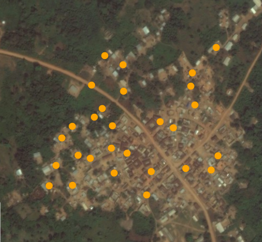]

---

# Amostra aleatória e tratamento aleatório

* Escolha aleatória dos grupos de <span style="color:blue">controle</span> e <span style="color:red">tratamento</span>

.center[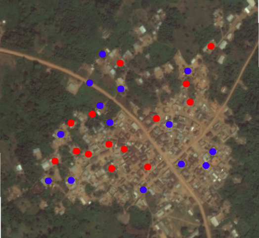]

---

# Exemplo: policiamento de "hot spots" em Minneapolis

.center[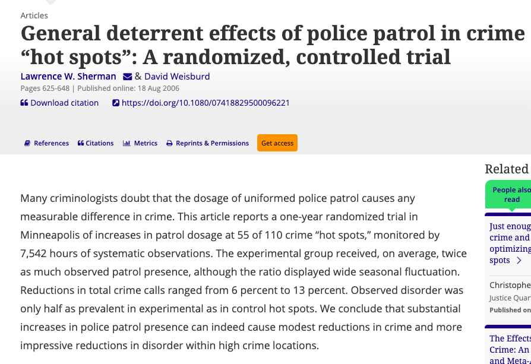]

---

# Tratamento

.center[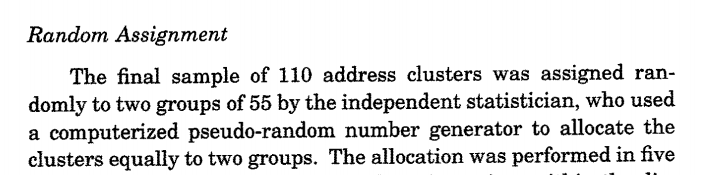]

.center[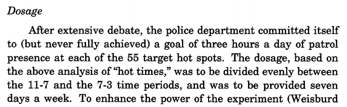]

.center[]

---

# Resultados

.center[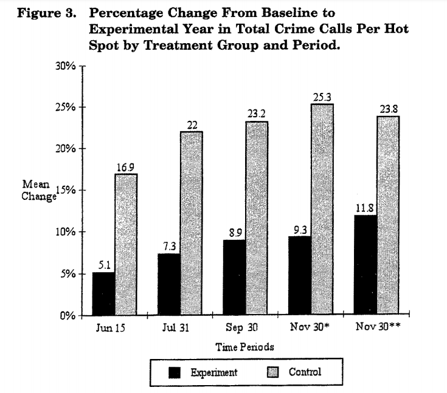]

---

class: center, middle, inverse

# Estudos observacionais: como criar grupos comparáveis 

---

# O que fazer quando o tratamento não foi aleatorizado?

* Estudos observacionais têm muito mais risco de viés de seleção

* Como o tratamento não foi dado pelos pesquisadores, ele pode ser apenas
  _observado_, mas não _manipulado_

* Desta forma, precisamos fazer ajustes nos modelos para tornar as unidades compatíveis

* Três formas:
  - Incluir variáveis de controle
  - Usar descontinuidades e analisar casos próximos
  - Criar um grupo de controle artificial parecido com o grupo de tratamento

---

# Regressão com variáveis de controle

* Tipo mais comum de análise estatística com mais de uma variável

* Pesquisadores incluem _variáveis de controle_ para eliminar a influência de certos fatores

* Ao adicionar uma variável, o modelo compara casos _com o valor médio de cada fator_ $X$

* $Y = \alpha + \beta T + \gamma X + \epsilon$

* Problemas: 
  - Podemos controlar pelas variáveis que conhecemos, não pelas que _não sabemos ou não medimos_ (variáveis omitidas)
  - Nem sempre é claro para os pesquisadores quais variáveis devem ser incluídas
  - A inclusão de variáveis desnecessárias pioram os modelos

---

# Exemplo: fatores que influenciam criminalidade globalmente

.center[]

---

# Exemplo: fatores que influenciam criminalidade globalmente

.center[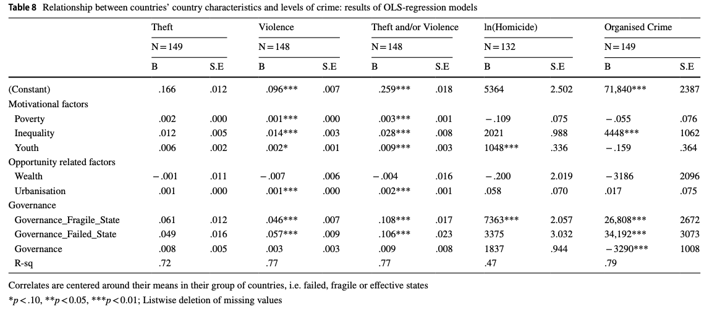]

---

# Regressão descontínua

* Outra forma de obter grupos comparáveis consiste em buscar uma descontinuidade e analisar as pessoas bem próximas ao corte

* Mudanças causadas por vários motivos: leis, requerimentos, etc

* Tratamento ocorre quando a pessoa está apenas _de um lado_ do corte

* Método quase tão eficiente quanto experimentos: casos próximos são geralmente muito comparáveis

* Premissas:
  - As pessoas não podem escolher em qual lado do corte elas estarão
  - Apenas grupos _próximos ao corte_ podem ser comparados: menor poder de generalização

---

# Exemplo: efeito do consumo de álcool na mortalidade de jovens

.center[]

---

# Exemplo: efeito do consumo de álcool na mortalidade de jovens

.center[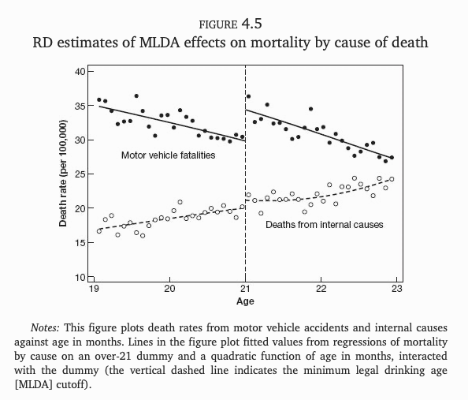]

---

# Controle sintético

* Em muitos casos, não há como realizar um experimento aleatório ou buscar uma descontinuidade existente

* Uma solução é criar um grupo de controle artificial que seja muito parecido com o grupo de tratamento

* A meta é, novamente, estabelecer uma comparação adequada

* _Controle sintético_ é um método que atribui pesos para unidades diferentes do grupo de controle

* Utilizado para medir diferenças no tempo

* Matematicamente complexo mas muito intuitivo

---

# Exemplo: efeito das políticas de redução de homicídio em São Paulo

.center[]

---

# Exemplo: efeito das políticas de redução de homicídio em São Paulo

.center[]

---

# Exemplo: efeito das políticas de redução de homicídio em São Paulo

.center[]

---

# Exemplo: efeito das políticas de redução de homicídio em São Paulo

.center[]

---

# Exemplo: efeito das políticas de redução de homicídio em São Paulo

.center[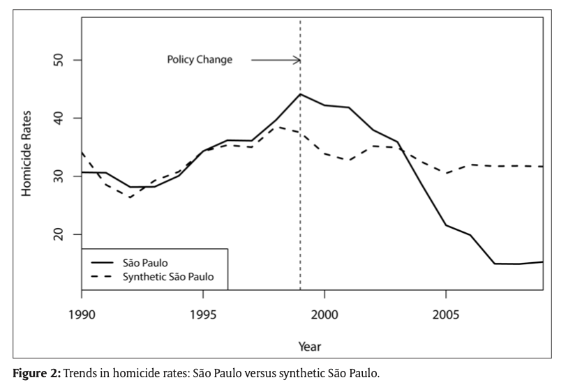]

---

# Resumo

* Políticas públicas baseadas em evidências são mais rigorosas, mais confiáveis, mais efetivas e menos ideológicas

* A força da evidência estatística vem da capacidade de diferenciar causa e efeito com clareza

* Experimentos são a melhor maneira para testar a eficácia de uma política

* A aleatorização do tratamento é o modo pelo qual asseguramos que a análise não tem viés de seleção nem variáveis omitidas

* Quando experimentos não são possíveis, seja por motivos práticos ou éticos, devemos analisar dados observacionais

---

# Resumo

* Correlações não implicam causalidade

* Em dados observacionais, é preciso garantir que os grupos sejam comparáveis, o que não é tarefa fácil

* Pode-se incluir variáveis adicionais aos modelos de regressão

* Pode-se também buscar por descontinuidades jurídicas, populacionais, geográficas, etc, e analisar casos próximos

* Por fim, na ausência de grupos comparáveis, podemos criar um grupo de controle sintético e estimar o impacto de um tratamento no tempo

---

# Sugestões de leitura

* Joshua Angrist e Stephen Pischke. [_Mastering 'Metrics: The Path from Cause to Effect_](https://www.masteringmetrics.com).
  Princeton University Press, 2014.

* Jake Bowers e Paul Testa. "[Better Government, Better Science: The Promise of
  and Challenges Facing the Evidence-Informed Policy
  Movement](https://www.annualreviews.org/doi/abs/10.1146/annurev-polisci-050517-124041)".
  _Annual Review of Political Science_, 2019.

* Nancy Cartwright e Jeremy Hardie. [_Evidence-Based Policy: A Practical
  Guide to Doing It
  Better_](https://global.oup.com/academic/product/evidence-based-policy-9780199841622?cc=br&lang=en&).
  Oxford University Press, 2012.

* Alan Gerber e Donald Green. [_Field Experiments: Design, Analysis, and
  Interpretation_](https://wwnorton.com/books/9780393979954). Norton Books,
  2012.

* Paul Holland. "[Statistics and Causal
  Inference](https://www.jstor.org/stable/2289064)". _Journal of the American
  Statistical Association_, 81:945–960, Dezembro de 1986.

---

# Sugestões de leitura

* Guido Imbens and Donald Rubin. [_Causal Inference in Statistics, Social, and
  Biomedical Sciences_](https://doi.org/10.1017/CBO9781139025751). Cambridge
  University Press, 2015.

* Stephen Morgan e Christopher Winship. [_Counterfactuals and Causal Inference:
  Methods and Principles for Social
  Research_](https://www.cambridge.org/core/books/counterfactuals-and-causal-inference/5CC81E6DF63C5E5A8B88F79D45E1D1B7).
  Cambridge University Press, 2014.

* Judea Pearl. [_Causality: Models, Reasoning, and
  Inference_](http://bayes.cs.ucla.edu/BOOK-2K/). Cambridge University Press,
  2000.

* Judea Pearl e Dana Mackenzie. [_The Book of Why: The New Science of Cause
  and Effect_](http://bayes.cs.ucla.edu/WHY/). Basic Books, 2018.

* Thomas Richardson e James Robins. "[Single World Intervention Graphs (swigs):
  A Unification of the Counterfactual and Graphical Approaches to
  Causality](https://csss.uw.edu/research/working-papers/single-world-intervention-graphs-swigs-unification-counterfactual-and)".
  Center for the Statistics and the Social Sciences, University of Washington
  Series. Working Paper, 128(30), 2013.

---

class: center, middle, inverse

# Muito obrigado!

---

# Contato

<br>

* Danilo Freire:

  - [danilofreire@gmail.com](mailto:danilofreire@gmail.com)
  - <http://danilofreire.github.io>
  - <http://github.com/danilofreire/apmbb-2020>

