```{r xaringan-themer, include=FALSE, warning=FALSE}
options(htmltools.dir.version = FALSE)
list.of.packages <- c("xaringan", "xaringanthemer")
new.packages <- list.of.packages[!(list.of.packages %in% installed.packages()[,"Package"])]
if(length(new.packages)) install.packages(new.packages)

library(xaringanthemer)
style_mono_accent(
  base_color          = "#1c5253",
  header_h1_font_size = "2.25rem",
  header_h2_font_size = "1.85rem",
  header_font_google  = google_font("Josefin Sans"),
  text_font_google    = google_font("Montserrat", "300", "300i"),
  text_font_size      = "1.25rem",
  code_font_google    = google_font("Fira Mono")
)
```

# Motivação

* Por que as pessoas são favoráveis à violência extrajudicial?
  
* Embora os linchamentos sejam praticamente inexistentes nos países ricos, eles
  continuam a acontecer com frequência nas nações em desenvolvimento

* Linchamentos representam um grave problema para a consolidação do estado de
  direito e do império da lei

* Diversas teorias sobre causas de linchamentos, muitas delas incompatíveis
  entre si

* Fenômeno pouco analisado na ciência política e mesmo nos estudos de violência

---

# Motivação

* Por que o Brasil?
  - Elevado número de linchamentos por ano
  - Alta desconfiança nas instituições públicas
  - Aceitação social de práticas de "justiça pelas próprias mãos"

* Boa parte dos estudos sobre linchamentos são baseados na experiência
  americana, onde raça parece ser o principal motor da violência civil

* Um estudo detalhado das atitudes que os cidadãos têm sobre linchamentos pode
  ajudar na formulação de políticas públicas mais eficientes

* Caso brasileiro pode servir como comparação para outros países
  latino-americanos com altos índices de violência, como México, Guatemala e
  Honduras

---

# O que fazemos neste trabalho

* O artigo apresenta três experimentos realizados entre outubro e dezembro de
  2020 com cerca de 2500 brasileiros

* No primeiro deles, analisamos em quais casos os brasileiros são mais
  tolerantes aos linchamentos
  - Características do criminoso, tipos de crime e características das vítimas

* No segundo experimento, avaliamos quais fatores estatais as pessoas usam como
  justificativa para os linchamentos
  - Ausência de policiamento, lentidão da justiça, baixa punição para
    criminosos

* Por fim, testamos quais tipos de mensagem reduzem a aceitação de linchamentos
  entre os participantes da pesquisa
  - Punição do estado, direitos humanos e vingança

---

# O que os dados nos dizem

* Homens brancos que cometem estupro ou molestam crianças são o perfil mais
  indicado para linchamentos

* Nenhum fator institucional é relevante para explicar o porquê dos cidadãos
  apoiarem este tipo de violência: a lógica parece ser a de "cultura da honra"

* Mencionar que o estado pune linchadores reduz significativamente o apoio a
  linchamentos

* Lembrar a possibilidade de vingança também diminui a aceitação dos
  linchamentos entre os participantes da pesquisa

* Mensagens sobre direitos humanos têm efeito zero nas atitudes dos
  indivíduos

* Resultados praticamente idênticos por estado, gênero, raça e renda

---

class: center, middle, inverse

# Breve revisão da literatura sobre linchamentos

---

# Menos estado, mais linchamentos

.center[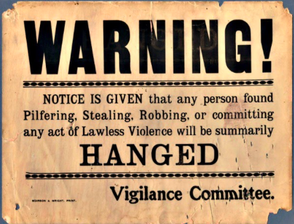]

---

# Menos estado, mais linchamentos

.center[]

---

# Mais instabilidade social, mais linchamentos

* Linchamentos como meio de criar coesão social ao punir os transgressores

.center[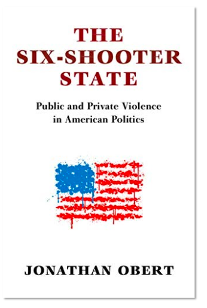]

---

# Mais racismo, mais linchamentos 

.center[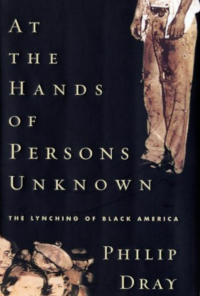]

---

# Mais estado, mais direitos humanos, mais linchamentos

.center[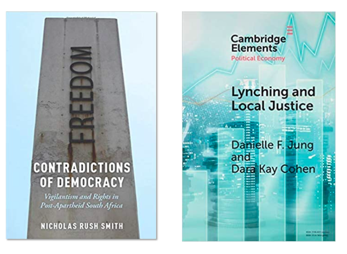]

---

# Mais violência do estado, mais linchamentos

.center[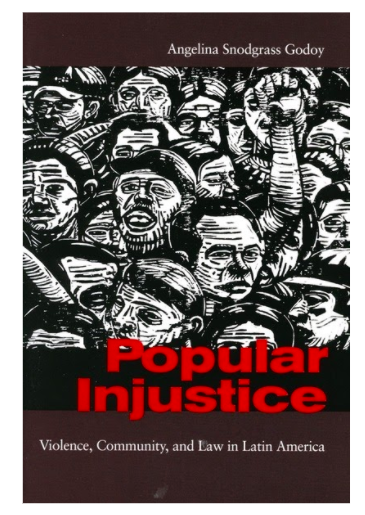]

---

# Lacunas na literatura

* Os estudos sobre linchamentos correlacionam os episódios de violência com
  variáveis de larga escala (globalização, formação do estado, racismo) que
  embora sejam úteis para entender as condições gerais da sociedade, não
  explicam o que acontece em nível local

* Linchamentos são fenômenos raros, assim, explicações muito gerais explicam
  pouco o que realmente motiva alguém a participar destes atos

* Nosso estudo preenche esta lacuna ao estudar os linchamentos sob a ótica dos
  indivíduos

* Enquanto sabemos, é o primeiro estudo experimental sobre atitudes a respeito
  de linchamentos no Brasil

* Nossa ideia é expandir este campo de pesquisa no Brasil e no exterior, não
  apenas realizando novos estudos aqui, mas também em outros países da
  América Latina

---

class: center, middle, inverse

# Experimento 01: quem são as vítimas de linchamento?

---

# Experimento de conjoint

* Mostramos aos participantes cinco pares de perfis com informações sobre
  casos de linchamentos

* Cada indivíduo deveria escolher o caso em que achasse que o linchamento mais
  justificado

* Nosso objetivo era estimar quais traços aumentam ou reduzem a chance de uma
  pessoa apoiar o linchamento

* Variamos 7 características de cada perfil

* Também incluímos uma caixa de texto para que as pessoas justificassem sua
  escolha se quisessem. A escrita era opcional

---

# Experimento de conjoint

| **Característica**  | **Níveis**                                                    |
| :---------------    | :-------                                                      |
| Gênero do criminoso | Feminino, masculino                                           |
| Idade do criminoso  | Adolescente, adulto, idoso                                    |
| Raça do criminoso   | Asiático, branco, indígena, negro                             |
| Crime               | Assassinato, bater carteira, estuprar, molestar, roubar carro |
| Gênero da vítima    | Feminino, masculino                                           |
| Idade da vítima     | Adolescente, adulto, idoso                                    |
| Linchadores         | Família da vítima, gangues, pedestres, policiais, vizinhos    |

---

# Experimento de conjoint

.center[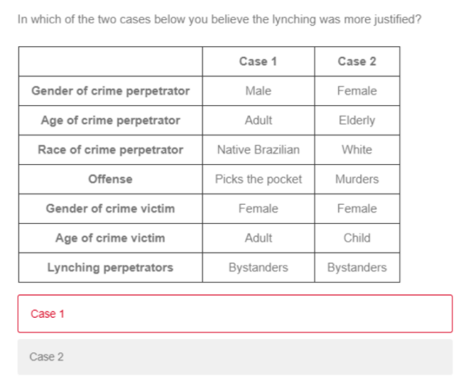]

---

# Resultados

.center[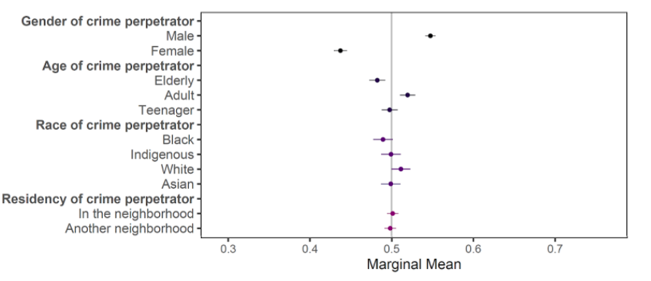]

---

# Resultados

.center[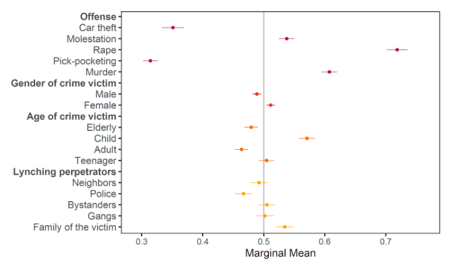]

---

# Análise textual das justificativas

.center[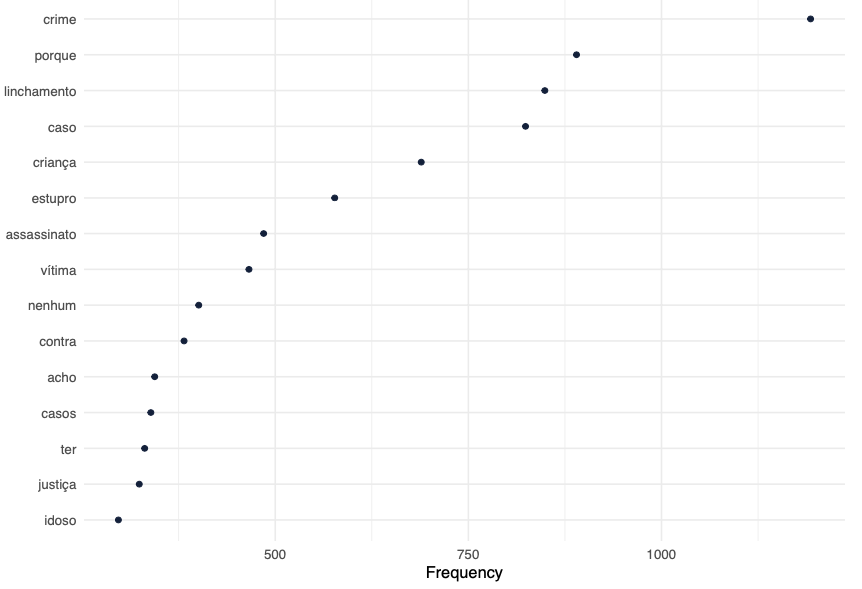]

---

# Análise textual das justificativas

.center[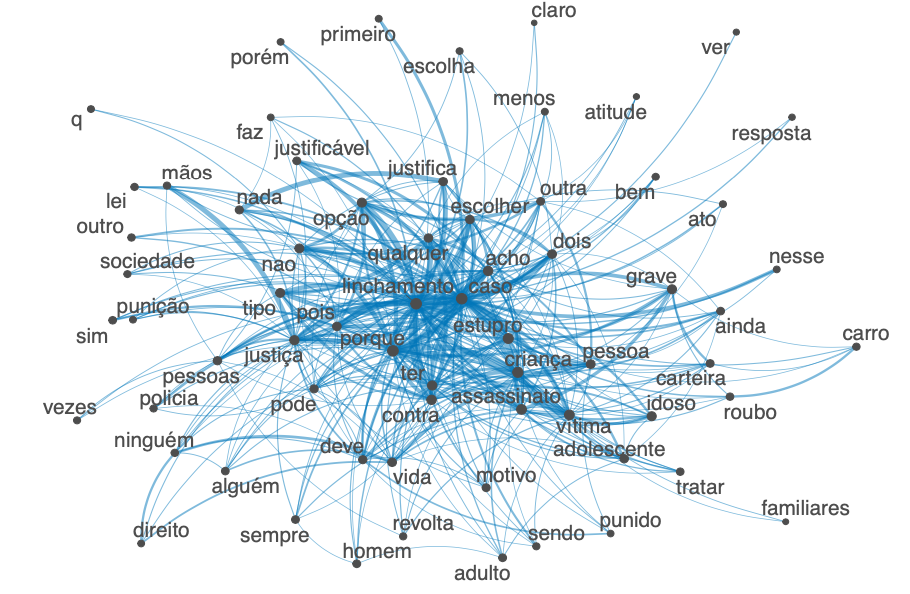]

---

class: center, middle, inverse

# Experimento 02: como os brasileiros justificam os linchamentos?

---

# Fatores institucionais

* Testamos três hipóteses que a literatura menciona como relevantes para
  justificar os linchamentos 
  - Hipótese 01: _baixa presença da polícia_ 
  - Hipótese 02: _lentidão no sistema judicial_ 
  - Hipótese 03: _demanda por penas mais duras aos criminosos_

* Cada participante leu um trecho de um caso real de linchamento, ocorrido em
  Jundiaí, que editamos para que os leitores não tivessem opinião formada
  sobre o episódio

* Temos três grupos de tratamento e um de controle. Os grupos de tratamento
  receberam a mesma notícia do grupo de controle, mas com uma frase adicional
  (que é o tratamento)

* Medimos o quanto as pessoas concordam com o que leram de 0-100

---

# Grupos de controle e tratamento

* **Controle**: Um homem foi linchado na última sexta-feira em Jundiaí, São
  Paulo. De acordo com vizinhos, ele tentou invadir uma residência mas foi
  imobilizado e agredido por membros da comunidade.

* **Tratamento 01 - Baixa presença da polícia:** Um homem foi linchado na
  última sexta-feira em Jundiaí, São Paulo. De acordo com vizinhos, ele tentou
  invadir uma residência mas foi imobilizado e agredido por membros da
  comunidade. **Um dos moradores envolvidos no linchamento disse que eles
  agrediram o suspeito porque "a polícia nunca patrulha o local".**

---

# Grupos de controle e tratamento

* **Tratamento 02 - Lentidão do sistema judicial**: Um homem foi linchado na
  última sexta-feira em Jundiaí, São Paulo. De acordo com vizinhos, ele tentou
  invadir uma residência mas foi imobilizado e agredido por membros da
  comunidade. **Um dos moradores envolvidos no linchamento disse que eles
  agrediram o suspeito porque "a justiça é muito lenta e os criminosos ficam
  soltos até o julgamento"**.

* **Tratamento 03 - Demanda por penas mais duras**: Um homem foi linchado na
  última sexta-feira em Jundiaí, São Paulo. De acordo com vizinhos, ele
  tentou invadir uma residência mas foi imobilizado e agredido por membros da
  comunidade. **Um dos moradores envolvidos no linchamento disse que eles
  agrediram o suspeito porque "a punição da justiça não é dura o
  suficiente"**.

---

# Resultados

.center[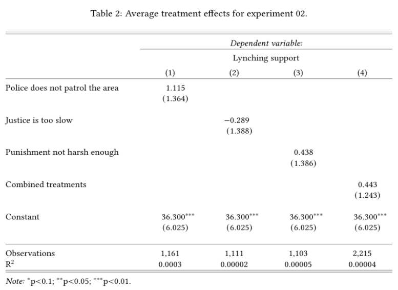]

---

class: center, middle, inverse

# Experimento 03: como reduzir o apoio popular aos linchamentos?

---

# Testando o efeito de campanhas de informação

* Em nosso último experimento, testamos a hipótese de que fornecer informações
  aos cidadãos pode ser uma política eficaz para diminuir o apoio civil à
  violência

* Três hipóteses:
  - Hipótese 01: _punição governamental aos linchadores_ 
  - Hipótese 02: _direitos humanos_ 
  - Hipótese 03: _ciclos de violência com vingança da família e amigos do
    criminoso linchado_

* Como no último experimento, novamente temos um grupo de controle e três
  grupos de tratamento

* Cada um deles recebe um texto, com os textos do grupo de tratamento contendo
  uma frase adicional

---

# Grupos de controle e tratamento

* **Controle**: No Brasil, algumas pessoas acreditam que linchamentos são
  justificados sob certas condições. O quanto você concorda ou discorda que
  linchamentos podem ser justificados? Por favor, use a barra abaixo para
  indicar sua preferência. Para indicar que discorda, use de 0 a 49; para
  concordar, use de 51 a 100. Por favor, use 50 caso você não concorde nem
  discorde.

* **Tratamento 01 - Punição governamental**: No Brasil, algumas pessoas
  acreditam que linchamentos são justificados sob certas condições.
  **Entretanto, a constituição e o código penal do Brasil proíbem
  estritamente os linchamentos e os envolvidos podem ser acusados de tortura
  ou assassinato.** O quanto você concorda ou discorda que linchamentos podem
  ser justificados? Por favor, use a barra abaixo para indicar sua
  preferência. Para indicar que discorda, use de 0 a 49; para concordar, use
  de 51 a 100. Por favor, use 50 caso você não concorde nem discorde.

---

# Grupos de controle e tratamento

* **Tratamento 02 - Direitos humanos**: No Brasil, algumas pessoas acreditam
  que linchamentos são justificados sob certas condições. **Entretanto, a
  constituição do Brasil afirma que todos os indivíduos têm o direito de não
  serem torturados, inclusive criminosos**. O quanto você concorda ou
  discorda que linchamentos podem ser justificados? Por favor, use a barra
  abaixo para indicar sua preferência. Para indicar que discorda, use de 0 a
  49; para concordar, use
de 51 a 100. Por favor, use 50 caso você não concorde nem discorde.

* **Tratamento 03 - Vingança**: No Brasil, algumas pessoas acreditam que
  linchamentos são justificados sob certas condições. **Entretanto,
  linchamentos podem iniciar um ciclo de violência pois a família ou amigos
  da vítima podem retaliar a comunidade**. O quanto você concorda ou discorda
  que linchamentos podem ser justificados? Por favor, use a barra abaixo para
  indicar sua preferência. Para indicar que discorda, use de 0 a 49; para
  concordar, use de 51 a 100. Por favor, use 50 caso você não concorde nem
  discorde.

---

# Resultados

.center[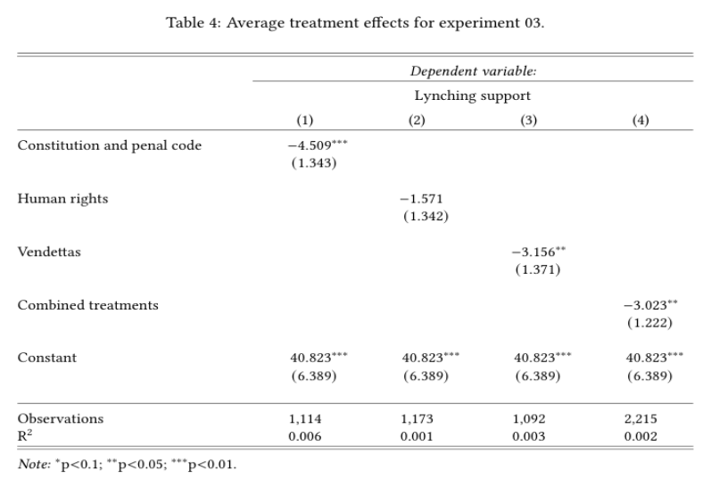]

---

# Conclusão

* Os resultados mostram que, no Brasil, as atitudes perante linchamentos
  são motivadas sobretudo pelas características pessoais do criminoso e da
  vítima

* Perfis de homens brancos adultos que estupram ou molestam crianças são
  escolhidos mais vezes

* Linchamentos conduzidos pela família da vítima são vistos como mais
  justificáveis

* As instituição do estado - polícia ou judiciário - não influenciam a decisão
  dos indivíduos

---

# Conclusão

* Informar os participantes sobre as consequências penais dos linchamentos
  reduz substancialmente seu apoio popular

* Ciclos de violência e vinganças também têm um forte efeito negativo sobre a
  opinião dos participantes

* Informações acerca de direitos humanos, entretanto, não possuem efeito em
  nosso experimento

* Resultados são robustos para diversos subgrupos

---

class: center, middle, inverse

# Muito obrigado mais uma vez!

---

# Contato

<br>

* Danilo Freire:

  - [danilofreire@gmail.com](mailto:danilofreire@gmail.com)
  - <http://danilofreire.github.io>
  - <http://github.com/danilofreire/apmbb-2021>

